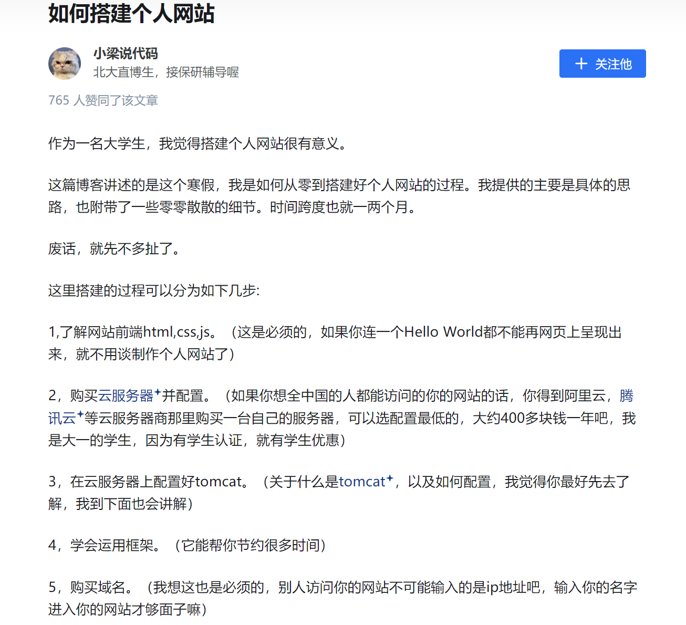

Welcome to **我的必做与选做**! 下面我将对以下内容展开回忆.
{: .message }

>- 个人信息
>- 学习情况
>- 职业规划
>**上述信息在word文档中体现**
>- **生活愿景**
  
---------
- 新技能
- 农村招标项目披露

## 生活愿景
  1.希望工作地点在家乡（其实感觉在哪里都可以，但是退休后应该是在家乡），如果有国外工作的可能，希望时间不宜过长，最多十年。  
  2.我希望工作稳定，属于稀缺性人才那种哈哈哈😄,对未来生活我没过多考虑，也没过多奢求，只是希望不要太简单，也不要困难得我难以喘气；人应当在考验与抉择中度过此生。  
  3.至于我想要成为什么样的人，我认为这是水到渠成的结果，我也难以用几个标签贴在我身上，我自认为我难以保持，我不愿意背着几个空壳在世上行走；总之，当我在往后几年、几十年回忆一些事的时候，发现我绝大多数在对的时空下做了对的事，那我就十分满足了。  
  4.我没有**最**崇拜的人，以我的评判标准得出值得我崇拜的人中，许多都是平行的。人的思维就是很奇妙，很难将这种非数指标量化为严谨的数值排列，所以我的脑子告诉我：我没法排出**最**崇拜的人。没法排出绝对的第一，但某些人当我想到他的神态作风的时候，他却能无限接近于这一位置。理查德。费曼教授就是这样一个例子。  
  在我的微信朋友圈主页上一直放着这张照片：
  
  至于为什么，如果我说我只从几个短视频或长视频、他的照片或他的访谈中就能将他排为伪1，你可能不信。**但确实是这样的**。最核心的是我认为他含有**真**这个属性。他的思考方式和一些想法是十分令人羡慕的，我估计很难达到他这种状态。[视频](https://www.bilibili.com/video/BV1wo4y197nX/?spm_id_from=333.337.search-card.all.click&vd_source=31b093f01b01f65c886b2a4b2ea15e38)

你知道，存在人类几百万年，有记录的、没有记录的；被推崇的、被贬低的；声名显赫的、默默无闻的；在世上活着的和死了的人太多了！改变世界的，一个是科学、一个是政治、一个是天地，而思考是这些的全部。

------
## 新技能——搭建网页
如你所见，现在你正在浏览一个网页。  
编写完成的网页花费了我3天，老师您要求`写一篇不少于3000字的学习记录及心得体会`,我估计写不了这么多，我真写这么多估计许多都是废话	😂；  
### 学习记录
1.

  

下面我来讲讲搭建我这样简单的网页的流程吧：  
1.创建`.github.io仓库`并进行相关设置；  
这就能拥有一个关联到属于自己的仓库的网址而不必购买云服务器  
2.本地安装`Jekll`主题(如果想保持在github提供的网页上打开就不必，主要为了方便本地服务器打开)；  
3.fork或clone喜欢的主题仓库到本地做删改再上传就变成自己希望的内容了。`本网页的搭建就基于某个主题，因为我不具备写大型网页的能力`  
>说明：2、3步骤可以直接不用进行，在仓库根目录下创建个index.html网页即可实现最简单地网页

### 成果展示
1.[纯html的不良导体导热系数计算网页](https://wenxintuanliu.github.io/Calculation-of-the-thermal-conductivity-of-poor-conductors.github.io/):
   
 2.[带少量css和js的简陋主页面](https://wenxintuanliu.github.io/stru-web.github.io/):
   

----
## 项目披露

<!-- - **To bold text**, use `<strong>`.
- *To italicize text*, use `<em>`.
- <mark>To highlight</mark>, use `<mark>`.
- Abbreviations, like <abbr title="HyperText Markup Langage">HTML</abbr> should use `<abbr>`, with an optional `title` attribute for the full phrase.
- Citations, like <cite>&mdash; Mark Otto</cite>, should use `<cite>`.
- <del>Deleted</del> text should use `<del>` and <ins>inserted</ins> text should use `<ins>`.
- Superscript text uses `` and subscript text uses ``. -->

## Footnotes

Footnotes are supported as part of the Markdown syntax. Here's one in action. Clicking this number[^fn-sample_footnote] will lead you to a footnote. The syntax looks like:


Clicking this number[^fn-sample_footnote]


Each footnote needs the `^fn-` prefix and a unique ID to be referenced for the footnoted content. The syntax for that list looks something like this:


[^fn-sample_footnote]: Handy! Now click the return link to go back.


You can place the footnoted content wherever you like. Markdown parsers should properly place it at the bottom of the post.

## Heading

Vivamus sagittis lacus vel augue rutrum faucibus dolor auctor. Duis mollis, est non commodo luctus, nisi erat porttitor ligula, eget lacinia odio sem nec elit. Morbi leo risus, porta ac consectetur ac, vestibulum at eros.

### Code

Inline code is available with the `<code>` element. Snippets of multiple lines of code are supported through Rouge. Longer lines will automatically scroll horizontally when needed. You may also use code fencing (triple backticks) for rendering code.


// Example can be run directly in your JavaScript console

// Create a function that takes two arguments and returns the sum of those arguments
var adder = new Function("a", "b", "return a + b");

// Call the function
adder(2, 6);
// > 8


You may also optionally show code snippets with line numbers. Add `linenos` to the Rouge tags.


// Example can be run directly in your JavaScript console

// Create a function that takes two arguments and returns the sum of those arguments
var adder = new Function("a", "b", "return a + b");

// Call the function
adder(2, 6);
// > 8


Aenean lacinia bibendum nulla sed consectetur. Etiam porta sem malesuada magna mollis euismod. Fusce dapibus, tellus ac cursus commodo, tortor mauris condimentum nibh, ut fermentum massa.

### Lists

Cum sociis natoque penatibus et magnis dis parturient montes, nascetur ridiculus mus. Aenean lacinia bibendum nulla sed consectetur. Etiam porta sem malesuada magna mollis euismod. Fusce dapibus, tellus ac cursus commodo, tortor mauris condimentum nibh, ut fermentum massa justo sit amet risus.

- Praesent commodo cursus magna, vel scelerisque nisl consectetur et.
- Donec id elit non mi porta gravida at eget metus.
- Nulla vitae elit libero, a pharetra augue.

Donec ullamcorper nulla non metus auctor fringilla. Nulla vitae elit libero, a pharetra augue.

1. Vestibulum id ligula porta felis euismod semper.
2. Cum sociis natoque penatibus et magnis dis parturient montes, nascetur ridiculus mus.
3. Maecenas sed diam eget risus varius blandit sit amet non magna.

Cras mattis consectetur purus sit amet fermentum. Sed posuere consectetur est at lobortis.

<dl>
  <dt>HyperText Markup Language (HTML)</dt>
  <dd>The language used to describe and define the content of a Web page</dd>

  <dt>Cascading Style Sheets (CSS)</dt>
  <dd>Used to describe the appearance of Web content</dd>

  <dt>JavaScript (JS)</dt>
  <dd>The programming language used to build advanced Web sites and applications</dd>
</dl>

Integer posuere erat a ante venenatis dapibus posuere velit aliquet. Morbi leo risus, porta ac consectetur ac, vestibulum at eros. Nullam quis risus eget urna mollis ornare vel eu leo.

### Images

Quisque consequat sapien eget quam rhoncus, sit amet laoreet diam tempus. Aliquam aliquam metus erat, a pulvinar turpis suscipit at.

Align to the center by adding `class="align-center"`:

{: .align-center}

### Tables

Aenean lacinia bibendum nulla sed consectetur. Lorem ipsum dolor sit amet, consectetur adipiscing elit.

<table>
  <thead>
    <tr>
      <th>Name</th>
      <th>Upvotes</th>
      <th>Downvotes</th>
    </tr>
  </thead>
  <tfoot>
    <tr>
      <td>Totals</td>
      <td>21</td>
      <td>23</td>
    </tr>
  </tfoot>
  <tbody>
    <tr>
      <td>Alice</td>
      <td>10</td>
      <td>11</td>
    </tr>
    <tr>
      <td>Bob</td>
      <td>4</td>
      <td>3</td>
    </tr>
    <tr>
      <td>Charlie</td>
      <td>7</td>
      <td>9</td>
    </tr>
  </tbody>
</table>

Nullam id dolor id nibh ultricies vehicula ut id elit. Sed posuere consectetur est at lobortis. Nullam quis risus eget urna mollis ornare vel eu leo.

-----

Want to see something else added? <a href="https://github.com/vszhub/not-pure-poole/issues/new">Open an issue.</a>

[^fn-sample_footnote]: Handy! Now click the return link to go back.
